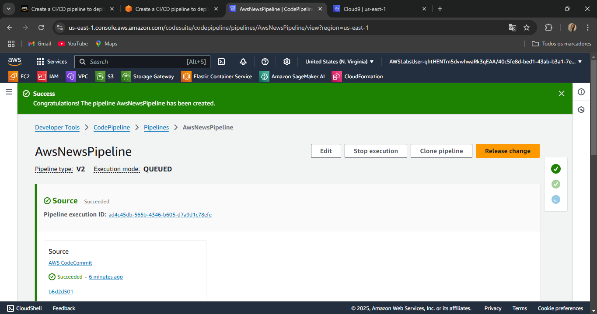
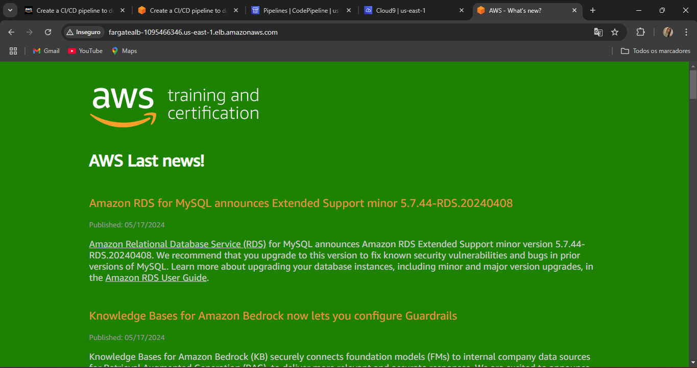

# CI/CD Pipeline com AWS CodePipeline + CodeDeploy + ECS - AWS SkillBuilder Lab

## ✅ Objetivo

Criar uma pipeline de CI/CD para implantar uma aplicação em container usando AWS CodePipeline e CodeDeploy com Amazon ECS.

## 🛠️ Passo a Passo

### 1. 📁 Criar Repositório no AWS CodeCommit
- Nome do repositório: `awsnews-application`
- Adicionar código fonte da aplicação e `appspec.yaml`.

### 2. 🛠️ Criar Grupo de Implantação (Deployment Group)
- Serviço: AWS CodeDeploy
- Plataforma: Amazon ECS
- Tipo de implantação: **Blue/Green**
- Role de serviço: `CodeDeployServiceRole`
- Nome do grupo: `awsnews-deployment-group`

### 3. 🚀 Criar Pipeline com o AWS CodePipeline
- Nome: `AwsNewsPipeline`
- Fases configuradas:
  - **Source**: AWS CodeCommit (gatilho via push)
  - **Deploy**: AWS CodeDeploy

### 4. ✅ Testar Pipeline
- Confirmar que:
  - Fase de Source foi bem-sucedida (ícone verde).
  - Implantação foi concluída com sucesso no ECS.
- Acompanhar o progresso no painel da pipeline.

### 5. 🌐 Validar no navegador
- Acessar o endpoint da aplicação no Fargate via Load Balancer.
- Confirmar renderização da página com as últimas notícias (estilo AWS News).

## 🧠 Conceitos aplicados

- AWS CodePipeline (CI/CD)
- AWS CodeDeploy com ECS (Blue/Green)
- AWS CodeCommit como repositório Git
- Amazon ECS com Fargate
- Integração contínua e entrega contínua (CI/CD)

---

🔗 Lab executado via [AWS SkillBuilder](https://skillbuilder.aws)
