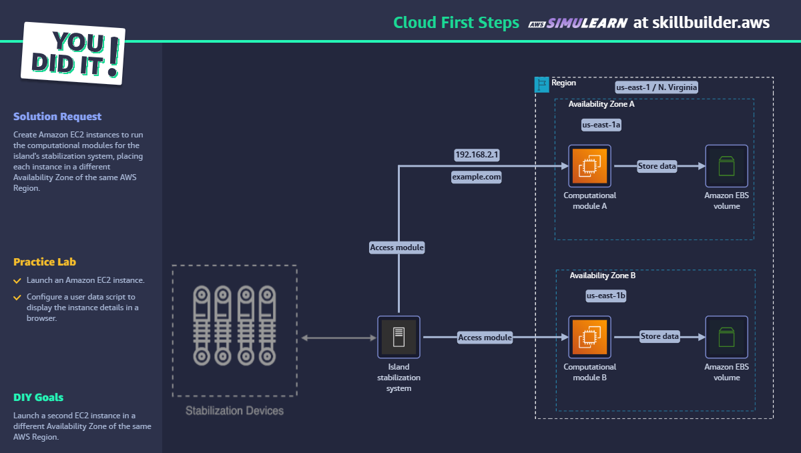

# Cloud First Steps - AWS SkillBuilder Lab

## ✅ Objetivo

Executar módulos computacionais em diferentes zonas de disponibilidade com EC2.

## 🛠️ Passo a Passo

1. Criar EC2 em `us-east-1a` com script de inicialização exibindo IP e hostname.
2. Anexar volume EBS para persistência de dados.
3. Criar segunda EC2 em `us-east-1b` com a mesma configuração.
4. Validar o acesso de ambas instâncias com navegador e hostname/IP.

## 🧠 Conceitos aplicados

- EC2
- EBS
- AZ Redundancy
- User Data Script
