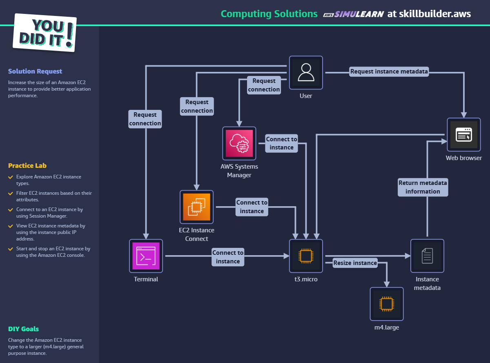

# Computing Solutions - AWS SkillBuilder Lab

## ✅ Objetivo

Redimensionar a instância EC2 para melhorar performance.

## 🛠️ Passo a Passo

1. Acessar EC2 > Instâncias.
2. Parar a instância `t3.micro`.
3. Acessar "Ações" > "Instância" > "Alterar tipo de instância".
4. Selecionar `m4.large` e salvar.
5. Iniciar novamente a instância.
6. Verificar conectividade via Systems Manager ou EC2 Connect.
7. Confirmar tipo com comando: `curl http://169.254.169.254/latest/meta-data/instance-type`.

## 🧠 Conceitos aplicados

- EC2 Instance Types
- Systems Manager
- Instance Metadata
