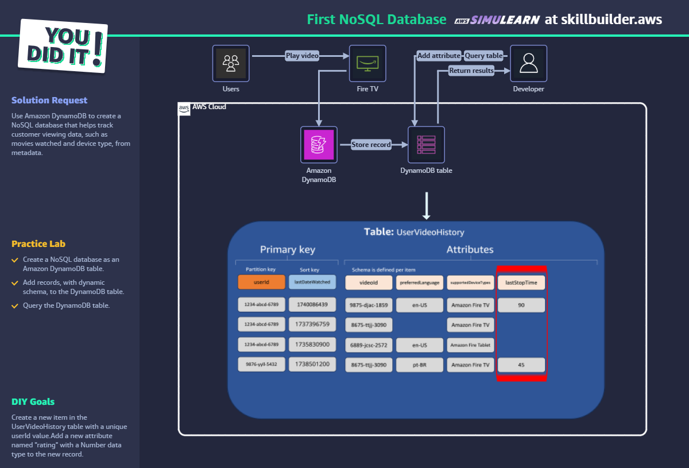

# First NoSQL Database - AWS SkillBuilder Lab

## ✅ Objetivo

Criar um banco NoSQL no DynamoDB para rastrear histórico de vídeos.

## 🛠️ Passo a Passo

1. Criar tabela `UserVideoHistory` com `userId` (Partition Key) e `lastDateWatched` (Sort Key).
2. Inserir registros com atributos variados (idioma, dispositivo, etc.).
3. Adicionar atributo `lastStopTime` (número).
4. Criar novo atributo `rating` em um item.
5. Consultar usando `Query` por `userId`.

## 🧠 Conceitos aplicados

- DynamoDB
- Esquema dinâmico
- Partição e ordenação
- Atributos personalizados
