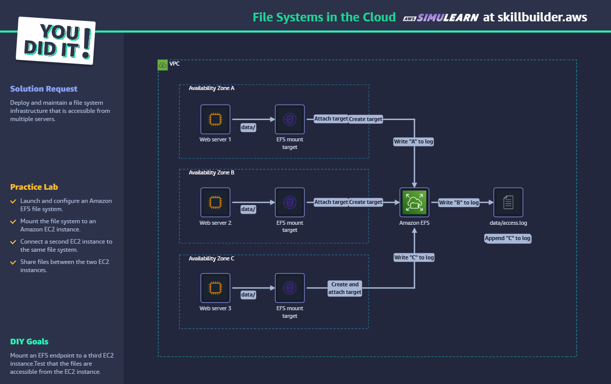

# File Systems in the Cloud - AWS SkillBuilder Lab

## ✅ Objetivo

Compartilhar arquivos entre instâncias EC2 em diferentes AZs usando EFS.

## 🛠️ Passo a Passo

1. Criar sistema de arquivos EFS.
2. Criar Mount Targets em 3 zonas de disponibilidade.
3. Lançar 3 instâncias EC2 (uma por AZ).
4. Montar EFS via `sudo mount -t nfs4 ...` nas 3 instâncias.
5. Escrever e ler arquivos no caminho comum (`/mnt/efs`).
6. Verificar conteúdo do arquivo `data/access.log`.

## 🧠 Conceitos aplicados

- Amazon EFS
- EC2 + NFS
- AZ Redundancy
- File sharing
