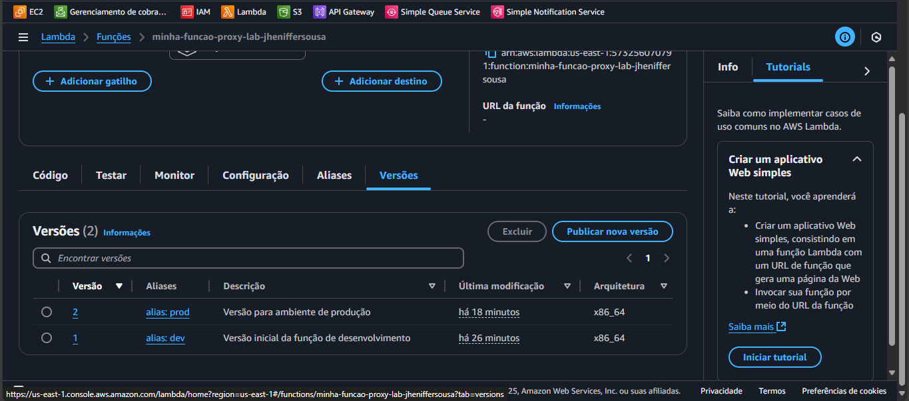
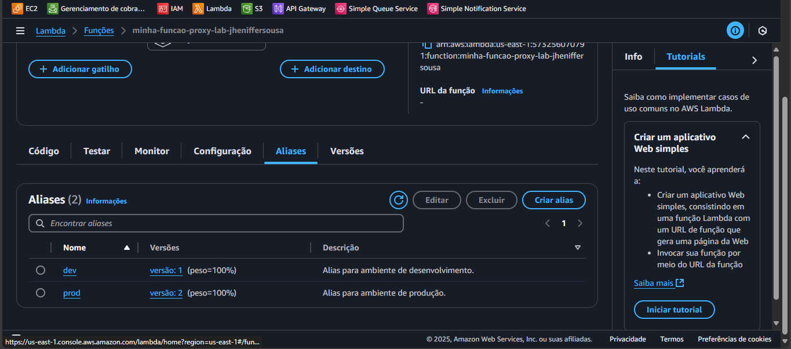
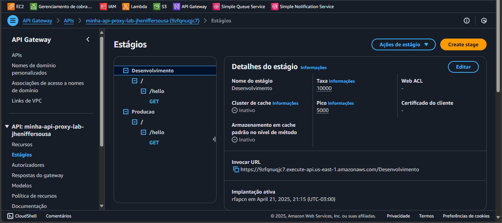
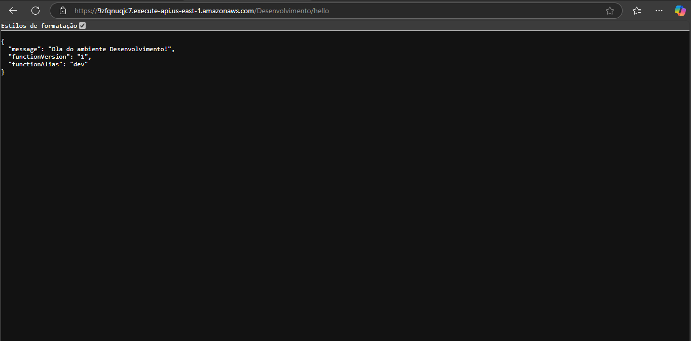

# ⚙️ Lambda + API Gateway com Aliases e Stages

Laboratório focado na criação de uma arquitetura **serverless** que separa ambientes de **desenvolvimento** e **produção** usando **AWS Lambda** e **API Gateway**.






---

## 🎯 Objetivo

Controlar o ciclo de vida da aplicação através de versões e aliases do Lambda, integrando com API Gateway via proxy, permitindo deploys seguros e organizados por ambiente.

---

## 🚀 Etapas Realizadas

1. Criar uma função **AWS Lambda** com integração do tipo Proxy.
2. Publicar duas versões distintas da função Lambda.
3. Criar **Aliases**:
   - `dev` → versão 1
   - `prod` → versão 2
4. Criar uma API REST no **API Gateway**.
5. Configurar a integração Proxy com Lambda.
6. Criar **Stages**:
   - `Desenvolvimento` → usa alias `dev`
   - `Producao` → usa alias `prod`
7. Testar os endpoints:
   - `/Desenvolvimento/hello` → retorna mensagem do ambiente dev
   - `/Producao/hello` → retorna mensagem do ambiente prod

---

## 🧪 Exemplo de Retorno

### ✅ Ambiente de Desenvolvimento
```json
{
  "message": "Olá do ambiente Desenvolvimento!",
  "functionVersion": "1",
  "functionAlias": "dev"
}


### ✅ Ambiente de Produção
```json
{
  "message": "Olá do ambiente de Producao!",
  "functionVersion": "2",
  "functionAlias": "prod"
}
