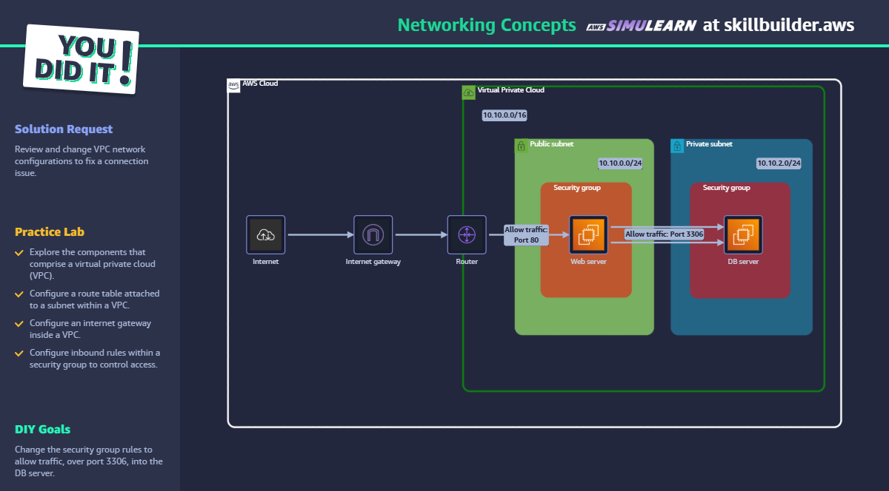

# Networking Concepts - AWS SkillBuilder Lab

## ✅ Objetivo

Corrigir a configuração da VPC para permitir comunicação segura entre Web Server e DB Server.

## 🛠️ Passo a Passo

1. Acesse o console da AWS e localize sua VPC.
2. Verifique se o Internet Gateway está associado à VPC.
3. Confira a tabela de rotas da subnet pública (deve ter rota 0.0.0.0/0 para o IGW).
4. Verifique o Security Group do Web Server — permitir tráfego HTTP (porta 80).
5. Verifique o Security Group do DB Server — permitir tráfego da porta 3306 **vindo do Web Server** (usando o ID de segurança ou IP).
6. Teste a comunicação entre Web e DB com comandos como `telnet` ou `mysql -h`.

## 🧠 Conceitos aplicados

- VPC
- Subnet pública e privada
- Internet Gateway
- Route Tables
- Security Groups
