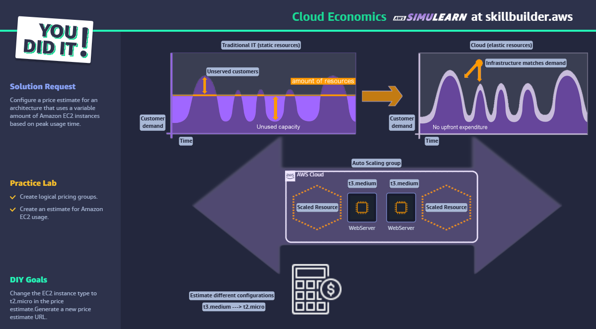

# Cloud Economics - AWS SkillBuilder Lab

## ✅ Objetivo

Criar uma estimativa de custo para uma arquitetura elástica com Auto Scaling.

## 🛠️ Passo a Passo

1. Acessar AWS Pricing Calculator.
2. Criar grupo com instâncias EC2 em Auto Scaling.
3. Estimar custo com tipo `t3.medium`.
4. Alterar para `t2.micro` e comparar estimativas.
5. Gerar link público do orçamento e salvar.

## 🧠 Conceitos aplicados

- AWS Pricing
- EC2 Auto Scaling
- Custo sob demanda
- Otimização de capacidade
