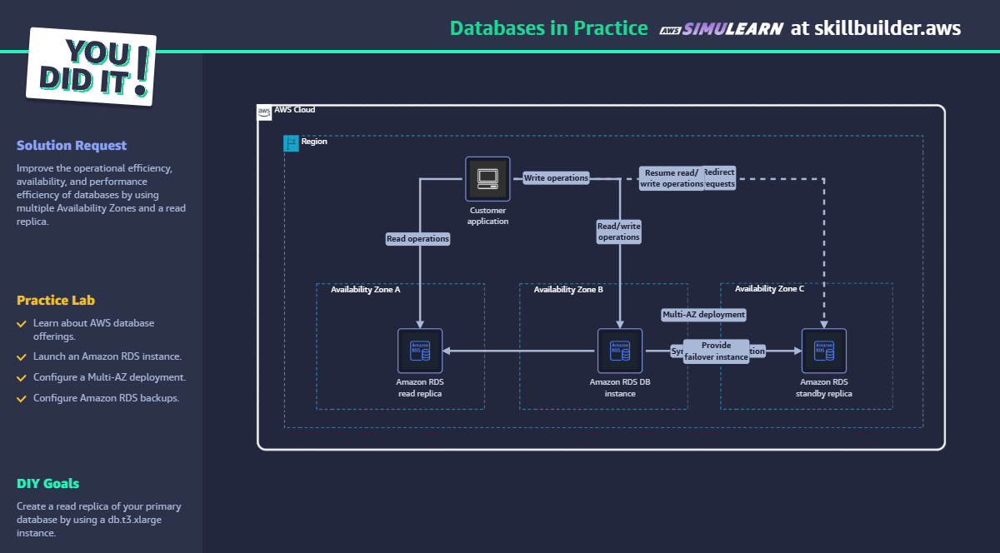

# Databases in Practice - AWS SkillBuilder Lab

## ✅ Objetivo

Melhorar a disponibilidade e escalabilidade de um banco RDS com Multi-AZ e Read Replica.

## 🛠️ Passo a Passo

1. Criar instância RDS com Multi-AZ ativado.
2. Criar backup e snapshots automáticos.
3. Criar uma Read Replica em uma zona diferente.
4. Testar leitura através da Read Replica.
5. Simular falha e observar failover automático.

## 🧠 Conceitos aplicados

- Amazon RDS
- Multi-AZ Deployment
- Read Replica
- Failover
