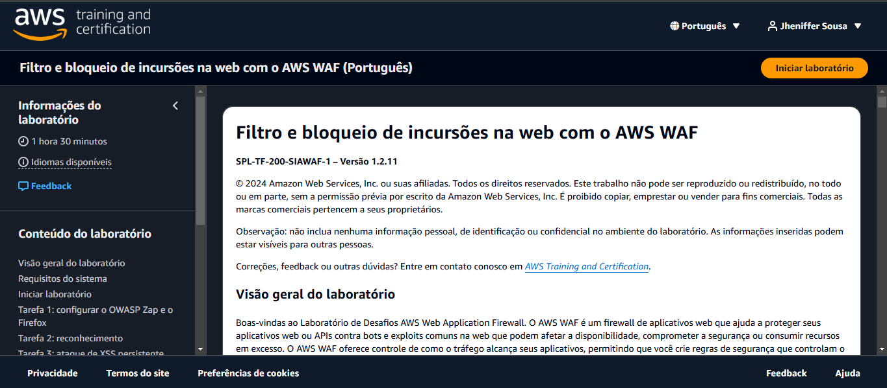
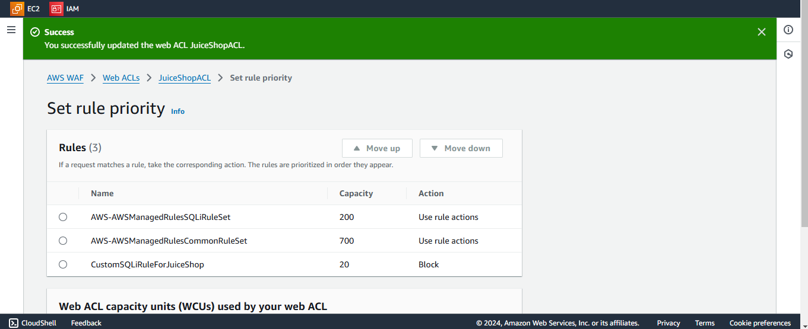
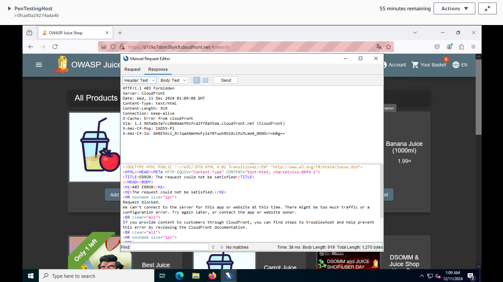

# Filtering and Blocking Web Incursions with AWS WAF - AWS SkillBuilder Lab

## ✅ Objetivo

Configurar e testar o AWS WAF para proteger uma aplicação contra ataques web comuns, como SQL Injection e XSS persistente.

## 🛠️ Passo a Passo

### 1. Acesso ao ambiente de teste
- Acesso ao OWASP Juice Shop hospedado na AWS.
- Configuração de ambiente com Kali Linux e ferramentas como OWASP Zap e Firefox.

### 2. Execução do ataque
- Simulação de ataque SQL Injection via URL utilizando ferramenta manual de requisição.
- Resultado esperado: tentativa de obter acesso negado com erro HTTP 403.

### 3. Criação da Web ACL no AWS WAF
- Nome da ACL: `JuiceShopACL`
- Associação à distribuição CloudFront da aplicação.

### 4. Adição das regras
- **AWSManagedRulesSQLiRuleSet** (detecta SQL Injection)
- **AWSManagedRulesCommonRuleSet** (proteções comuns)
- **CustomSQLiRuleForJuiceShop** (regra personalizada com ação: `Block`)

### 5. Teste final
- Repetição do ataque para verificar se a Web ACL está bloqueando corretamente.
- Resultado: ataque bloqueado com sucesso (código 403).

## 🧠 Conceitos aplicados

- AWS WAF (Web Application Firewall)
- Web ACLs
- Regras gerenciadas vs regras personalizadas
- Simulação de ataques com OWASP Juice Shop
- Segurança em aplicações web

---

🔐 **Lab executado via [AWS SkillBuilder](https://skillbuilder.aws)**

