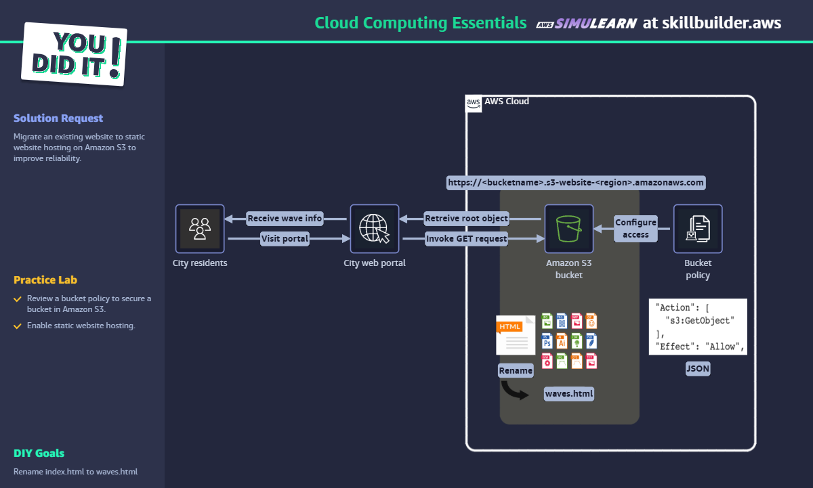

# Cloud Computing Essentials - AWS SkillBuilder Lab

## ✅ Objetivo

Transformar um site em HTML em uma hospedagem estática usando Amazon S3.

## 🛠️ Passo a Passo

1. Criar bucket com nome único (ex: `meusite-lab123`).
2. Acessar propriedades e habilitar *Static Website Hosting*.
3. Fazer upload do arquivo `waves.html`.
4. Definir `waves.html` como documento de índice.
5. Adicionar bucket policy permitindo acesso público com permissão `s3:GetObject`.
6. Acessar a URL `http://<bucket>.s3-website-<region>.amazonaws.com`.

## 🧠 Conceitos aplicados

- Amazon S3
- Static Website Hosting
- Bucket Policy
